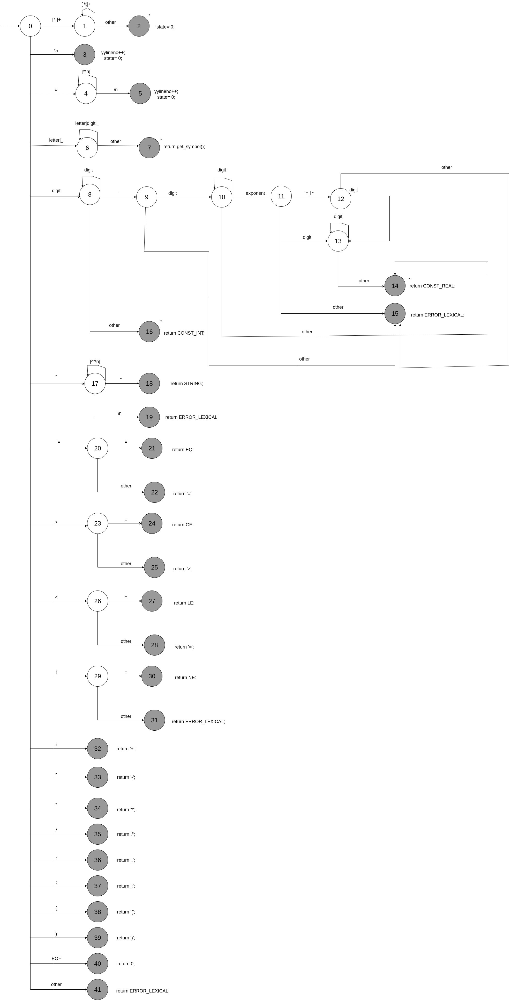

# Práctica 1: Análisis léxico

Este repositorio representa una visualización del desarrollo del laboratorio de Automátas y Compiladores, en donde se aplican los contenidos teóricos y prácticos asociado a la fase de análisis léxico de un compilador. 

En este caso, se debe realizar un scanner desde cero programado en C. Este scanner consta de un alfabeto para un pseudo-lenguaje llamado TDL, donde Σ = {AND, BREAK, CONST INT, CONST REAL, CONTINUE, ELSE, END, ENDIF, ENDWHILE, EQ, FALSE, GE, IDENTIFIER, IF, INT, LE, NE, NOT, OR, PROGRAM, READ, REAL, STOP, STRING, THEN, TRUE, WHILE, WRITE, WRITELN, ‘,’, ‘=’, ‘>’, ‘<’, ‘-’, ‘(’, ‘)’, ‘+’, ‘;’, ‘/’, ‘*’}, y se considera que:

- IDENTIFIER comienza con una letra o guión bajo, seguido de cero o más caracteres que pueden ser: letras, dígitos o guiones bajos. C
- CONST INT es uno o más dígitos.
- CONST REAL comienza con uno o máss dígtos, seguido de una parte fraccionaria obligatoria, seguida opcionalmente de una parte exponencial la cual comienza con ‘E’ o ‘e’, luego le sigue opcionalmente un carácter ‘+’ o ‘-’ y termina siempre con uno o más dígitos. 
- STRING es una cadena de caracteres que comienza y termina con el carácter de comillas dobles. No se admiten dentro de la cadena ni el carácter de comillas dobles ni el carácter enter.
- {AND, BREAK, CONTINUE, ELSE, END, ENDIF, ENDWHILE, FALSE, IF, INT, NOT, OR, PROGRAM, READ, REAL, STOP, THEN, TRUE, WHILE, WRITE, WRITELN} son las palabras reservadas que se escriben siempre en minúsculas en el archivo fuente. En particular {AND, NOT, OR} identifican a los operadores lógicos. 
- {EQ, GE, LE, NE} identifican a los operadores relacionales que tienen los siguientes patrones: “==”, “>=”, “<=” y “!=”.

La representación visual final del analizador léxico sería la siguiente:




### Estructura del repostiroio

```
digalin/Compiladores-Practica1/  
├── compare.tdl     # Código para probar el funcionamiento del lexer
├── main.00.c       # Aplicación el lexer construido en tdl.lex.00.c en archivos desde la terminal (parser)
├── sumatoria.tdl   # Código para probar el funcionamiento del lexer
└── tdl.lex.00.c    # Analizador léxico principal que convierte la imagen anterior a código C. (scanner)
```

### Ejecución del analizador léxico TDL

Para correr el programa, se debe escribir el siguiente comando en la terminal:
```bash
gcc -o tdl tdl.lex.00.c main.00.c
```

Esto generará el ejecutable `tdl`, que permitirá probar los códigos `sumatoria.tdl` y `compare.tdl` secuencialmente.

```bash
./tdl sumatoria.tdl
./tdl compare.tdl
```

Si todo funciona bien, debería visualizar un conjunto de números que representan el conjunto de IDs del proyecto