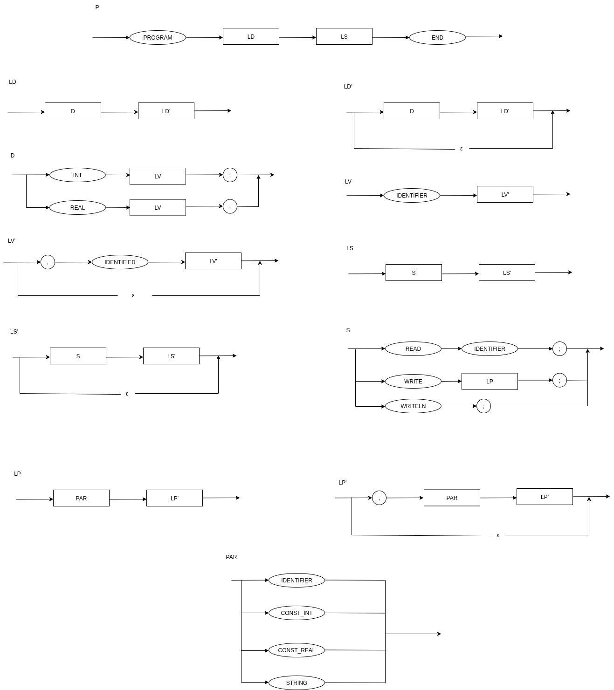

# Práctica 2

Esta práctica consiste en el desarrollo desde cero de un **parser recursivo descendente** en lenguaje C, correspondiente a la segunda fase del compilador para el pseudo-lenguaje **TDL**, continuando con la construcción del proyecto iniciado en la práctica anterior (scanner).

El parser toma como entrada la secuencia de tokens generada por el analizador léxico y valida que el programa fuente cumpla las reglas sintácticas del subconjunto de TDL definido en la gramática BNF.  
La práctica incluye la eliminación de la recursividad por la izquierda, el diseño mediante diagramas sintácticos de Wirth.

---

### Gramática base utilizada

El subconjunto de producciones del lenguaje TDL sobre el cual se trabaja está dado por la siguiente gramática BNF:

P : PROGRAM LD LS END
LD : D | LD D
D : INT LV ';' | REAL LV ';'
LV : IDENTIFIER | LV ',' IDENTIFIER
LS : S | LS S
S : READ IDENTIFIER ';' | WRITE LP ';' | WRITELN ';'
LP : PAR | LP ',' PAR
PAR : IDENTIFIER | CONST_INT | CONST_REAL | STRING


Tras eliminar la recursión por la izquierda, la gramática final adaptada para el parser recursivo descendente queda como:

P : PROGRAM LD LS END
LD : D LD'
LD' : D LD' | ε
D : INT LV ';' | REAL LV ';'
LV : IDENTIFIER LV'
LV' : ',' IDENTIFIER LV' | ε
LS : S LS'
LS' : S LS' | ε
S : READ IDENTIFIER ';' | WRITE LP ';' | WRITELN ';'
LP : PAR LP'
LP' : ',' PAR LP' | ε
PAR : IDENTIFIER | CONST_INT | CONST_REAL | STRING

En aplicando el diagrama de Wirth, se visualizaría de la siguiente forma:



### Compilación

Para generar el ejecutable del compilador TDL, ejecutar los siguientes comandos desde la terminal:

```bash
flex tdl.flex
gcc -o tdl main.c tdl.c lex.yy.c -lfl
```

Esto creará el ejecutable `tdl`, el cual combina el analizador léxico (scanner) con el sintáctico (parser).

### Ejecución

Para probar el funcionamiento del compilador con los archivos de ejemplo:

```bash
./tdl sumatoria.tdl
./tdl compare.tdl
```

Si el código fuente TDL es válido, no se mostrará ningún mensaje de error en la terminal.
En caso de detectar errores léxicos o sintácticos, el programa indicará el tipo y la línea correspondiente.
